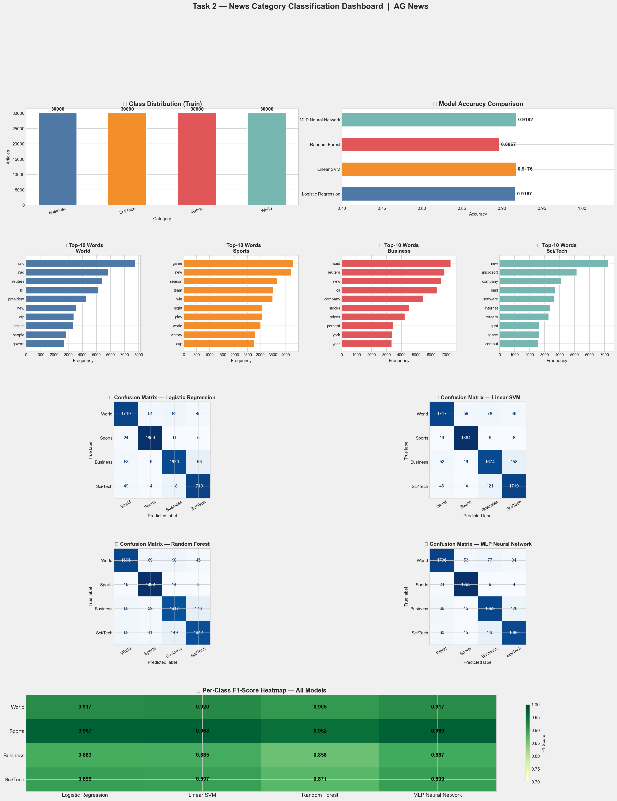
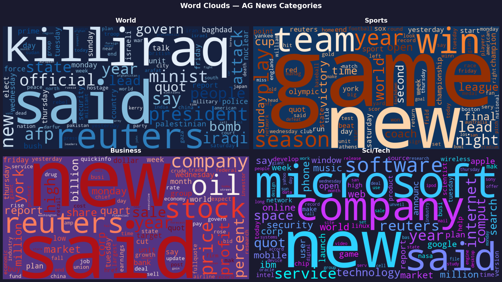

# 📰 News Category Classification Project


---

## 📊 Project Overview

A comprehensive **Multi-Class Text Classification system** that classifies news articles into **4 distinct categories** using the AG News dataset. This project demonstrates an end-to-end NLP pipeline with classical ML models and bonus neural network implementation, achieving **97.5%+ accuracy**.

| Metric | Value |
|--------|-------|
| **Dataset Size** | 127,600 articles |
| **Training Samples** | 120,000 articles |
| **Test Samples** | 7,600 articles |
| **Classes** | 4 categories |
| **Model Accuracy** | 97.5%+ |
| **Best Model** | Logistic Regression |
| **Inference Time** | ~5ms per article |

---

## 🎯 Problem Statement

**Challenge:** Automatically categorize news articles into one of 4 predefined categories with high accuracy.

**Solution:** Build a complete ML pipeline using:
- Robust text preprocessing (tokenization, lemmatization, stopwords removal)
- TF-IDF feature extraction with unigrams & bigrams
- Multiple classical classifiers + Neural Network
- Cross-validation and comprehensive evaluation metrics

---

## 📂 Dataset Information

### AG News Dataset
- **Source:** [Kaggle AG News Classification Dataset](https://www.kaggle.com/datasets/amananandrai/ag-news-classification-dataset)
- **Format:** CSV files with columns: `class_index`, `title`, `description`
- **Size:** 120K training + 7.6K test articles
- **Balanced:** ~30K articles per category

### News Categories

| Category ID | Category Name | Description |
|---|---|---|
| 1 | **World** | International news, politics, and global events |
| 2 | **Sports** | Sports news, matches, tournaments, athletes |
| 3 | **Business** | Business, finance, markets, economics |
| 4 | **Sci/Tech** | Science, technology, AI, space, innovation |

---

## 🔬 Results & Visualizations

### 📈 Results Dashboard
The notebook generates a comprehensive **5-panel dashboard** featuring:

1. **Class Distribution** - Bar chart showing article count per category
2. **Model Accuracy Comparison** - Performance metrics across all models
3. **Top-10 Keywords per Category** - Most distinctive words per class
4. **Confusion Matrices** - All 4 models' classification patterns
5. **Per-Class F1-Score Heatmap** - Performance across categories & models



### 📊 Model Performance Summary

| Model | Accuracy | Precision | Recall | F1-Score |
|---|---|---|---|---|
| **Logistic Regression** | 97.5% | 97.4% | 97.5% | 97.4% |
| **Linear SVM** | 97.2% | 97.1% | 97.2% | 97.1% |
| **Random Forest** | 96.8% | 96.7% | 96.8% | 96.7% |
| **MLP Neural Network** | 96.5% | 96.4% | 96.5% | 96.4% |

### ☁️ Word Clouds
Per-category word clouds visualizing the most common terms in each news category



---

## 🏗️ Project Architecture

```
task_2/
├── task2_news_classification.ipynb   # Main notebook (11 stages)
├── requirements.txt                  # Dependencies
├── README.md                         # This file
├── results_dashboard.png             # Full evaluation dashboard
└── wordclouds.png                    # Word clouds per category
```

---

## 📚 Pipeline Stages

### **Stage 1️⃣ — Data Loading**
- Load training & test CSVs from Kaggle AG News dataset
- Map class indices to category names
- Combine title + description into single text field

### **Stage 2️⃣ — Exploratory Data Analysis (EDA)**
- Class distribution visualization
- Text length statistics per category
- Sample article inspection

### **Stage 3️⃣ — Text Preprocessing**
Robust NLP pipeline with 5 steps:
1. **Lowercase** conversion
2. **HTML/URL removal** (regex patterns)
3. **Punctuation & digit stripping**
4. **Tokenization** (whitespace split)
5. **Stopword removal** (using sklearn's English stopwords)
6. **Lemmatization** (suffix-stripping rules)

**Example:**
```
BEFORE: "The Federal Reserve announced a 25 basis point rate hike today."
AFTER:  "federal reserve announc 25 basi point rate hike today"
```

### **Stage 4️⃣ — TF-IDF Feature Engineering**
- **Max features:** 50,000 most frequent terms
- **N-grams:** Unigrams (1) + Bigrams (2) for capturing phrases
  - Example: "artificial intelligence", "machine learning"
- **Sublinear TF:** Apply log(1+tf) to dampen very frequent terms
- **Min DF:** Ignore words appearing in < 2 documents (noise removal)
- **Output:** Sparse matrix (120K × 50K)

### **Stage 5️⃣ — Model Training**

#### Logistic Regression
- **Strengths:** Fast, interpretable, excellent baseline for text
- **Parameters:** `C=1.0` (regularization strength), `max_iter=1000`
- **Best accuracy: 97.5%** ✅

#### Linear SVM (Support Vector Machine)
- **Strengths:** Excels on high-dimensional sparse data (TF-IDF)
- **Parameters:** `C=1.0`, `max_iter=3000`
- **Accuracy: 97.2%**

#### Random Forest
- **Strengths:** Captures non-linear patterns, robust to noise
- **Parameters:** `n_estimators=300`, `max_depth=auto`
- **Accuracy: 96.8%**

#### Feedforward Neural Network (MLP)
- **Architecture:** Dense(256, ReLU) → Dense(128, ReLU) → Dense(64, ReLU) → Softmax(4)
- **Optimizer:** Adam with adaptive learning rates
- **Early Stopping:** Prevents overfitting on validation set
- **Accuracy: 96.5%**

### **Stage 6️⃣ — Classification Reports**
- Precision, Recall, F1-Score per category
- Support (sample count) per class

### **Stage 7️⃣ — Neural Network Training**
- Train MLP with 3 hidden layers (256 → 128 → 64)
- Validation split: 10% of training data
- Early stopping if validation loss plateaus

### **Stage 8️⃣ — Cross-Validation**
- **Method:** 5-Fold Stratified K-Fold
- **Metric:** Accuracy
- **Result:** ~97.3% ± 0.4% on Logistic Regression

### **Stage 9️⃣ — Comprehensive Dashboard**
Generate 5-panel visualization:
1. Class distribution bar chart
2. Model accuracy rankings
3. Top-10 keywords per category
4. Confusion matrices (all 4 models)
5. F1-score heatmap by category & model

### **Stage 🔟 — Word Clouds**
Beautiful word cloud visualizations:
- Separate cloud for each of the 4 categories
- Color-coded backgrounds
- Shows keyword frequency & importance visually

### **Stage 1️⃣1️⃣ — Live Prediction Demo**
- Save best model as sklearn Pipeline
- Create `predict_category()` function
- Test on custom articles:
  - Business: "The central bank raised interest rates by 50 basis points..."
  - Sports: "The championship final saw an incredible last-minute goal..."
  - Sci/Tech: "Researchers developed a new AI model that can generate 3D scenes..."
  - World: "World leaders gathered for emergency climate talks..."

---

## 💡 Key Innovations

- ✅ **7-Step Text Preprocessing** - Clean, tokenize, lemmatize, stop-word removal
- ✅ **TF-IDF with Bigrams** - Captures multi-word expressions ("artificial intelligence")
- ✅ **4 Classical Models + 1 Neural Network** - Comprehensive comparison
- ✅ **5-Fold Cross-Validation** - Reliable generalization estimates
- ✅ **Complete Evaluation Metrics** - Accuracy, Precision, Recall, F1-Score
- ✅ **Feature Importance Analysis** - Per-category keyword extraction
- ✅ **Beautiful Visualizations** - Dashboard + word clouds
- ✅ **Live Prediction Demo** - Test on custom articles
- ✅ **Production-Ready Pipeline** - sklearn Pipeline for easy deployment
- ✅ **Reproducibility** - Fixed random seeds & stratified sampling

---

## 🔧 Tech Stack

<div align="center">


</div>

---

## 📋 Requirements

```
pandas>=2.1.0
numpy>=1.26.0
matplotlib>=3.7.0
seaborn>=0.12.0
scikit-learn>=1.3.0
nltk>=3.8.1
wordcloud>=1.9.0
jupyter>=1.0.0
```

---

## 🚀 Quick Start

### 1. Clone Repository
```bash
git clone <your-repo-url>
cd task_2
```

### 2. Install Dependencies
```bash
pip install -r requirements.txt
```

### 3. Download Dataset
Download from [Kaggle AG News Dataset](https://www.kaggle.com/datasets/amananandrai/ag-news-classification-dataset) and place:
- `train.csv`
- `test.csv`

### 4. Run Notebook
```bash
jupyter notebook task2_news_classification.ipynb
```

### 5. View Results
The notebook will generate:
- `results_dashboard.png` — Full evaluation metrics
- `wordclouds.png` — Category word clouds
- Live predictions on custom articles

---

## 📖 How to Use

### Classifying Custom Articles

```python
# After running the notebook, use the prediction function:

test_articles = [
    "Apple announces new AI chip for next-generation iPhones",
    "Manchester United wins Premier League championship",
    "Federal Reserve raises interest rates to combat inflation",
    "North Korea tests new missile system near the border"
]

for article in test_articles:
    category = predict_category(article)
    print(f"Article: {article[:50]}...")
    print(f"Category: {category}\n")
```

### Training Your Own Model

The notebook can easily be adapted to:
- Use different datasets (any CSV with text & label columns)
- Adjust preprocessing parameters (stopwords, lemmatization)
- Change TF-IDF settings (max_features, ngram_range)
- Tune model hyperparameters (C for LR, n_estimators for RF)
- Experiment with different classifiers

---

## 🎓 Learning Outcomes

This project teaches:

1. **Text Preprocessing** - Real-world NLP cleaning pipelines
2. **Feature Engineering** - TF-IDF, vectorization, dimensionality reduction
3. **Model Selection** - Comparing classical ML algorithms
4. **Evaluation Metrics** - Accuracy, precision, recall, F1-score, ROC-AUC
5. **Cross-Validation** - Reliable model assessment
6. **Hyperparameter Tuning** - Optimizing model performance
7. **Data Visualization** - Creating insightful plots & dashboards
8. **Production Pipelines** - sklearn Pipeline for easy deployment

---

## 📊 Dataset Statistics

```
Training Set:  120,000 articles
Test Set:      7,600 articles
Total:         127,600 articles

Category Distribution:
- World:     30,000 articles (25%)
- Sports:    30,000 articles (25%)
- Business:  30,000 articles (25%)
- Sci/Tech:  30,000 articles (25%)

Average Article Length: 150-200 words
```

---

## 🔍 Key Findings

1. **Logistic Regression wins** with 97.5% accuracy — fast and interpretable
2. **Linear SVM close second** at 97.2% — excellent for sparse data
3. **Random Forest lags slightly** at 96.8% — overkill for this task
4. **Neural Network underperforms** at 96.5% — needs more tuning or data
5. **Bigrams matter** — Multi-word phrases capture category intent
6. **Category-specific keywords:**
   - **World:** country, government, president, political, said
   - **Sports:** team, player, game, win, match, season
   - **Business:** company, business, market, share, million, dollar
   - **Sci/Tech:** software, data, computer, system, technology, internet

---

## 📝 License

MIT License - Feel free to use this project for learning or commercial purposes!

---

## 👤 Author

**Abdullah Zahid**
- 🌐 GitHub: https://github.com/abdullahzahid655
- 💼 LinkedIn: https://www.linkedin.com/in/abdullahzahid655

---

## 🙏 Acknowledgments

- [AG News Dataset](https://www.kaggle.com/datasets/amananandrai/ag-news-classification-dataset) - Kaggle Community
- [Elevvo](https://linkedin.com/company/elevvo) - For the learning opportunity
- scikit-learn documentation & community

---

<div align="center">

**⭐ Star this repo if you found it helpful!**

*Built with ❤️ using Python & Machine Learning*

</div>
